# pixel-vfx-local

Original local pixel-art VFX editor: live effect preview, playback/scrubbing, seeded
deterministic effects, 2D camera controls, a real 3D workflow (orbit camera, procedural
geometry, software z-buffer renderer, HDR bloom + 3-pass alpha matting post), output
resolution/fps/frame-range, palette quantization + dither + outline + recolor, per-frame
timing holds, **editable timing markers**, PNG sprite-sheet / GIF / **Aseprite .aseprite** /
**Godot .tres** / **Unity .meta** export, an **MCP stdio control server**, and a
**token-gated desktop shell**. Zero runtime dependencies (plain ES modules + Canvas 2D;
all encoders are bundled original implementations).

This is an original implementation built from a feature checklist (see `PARITY.md`).
No vendor source, shaders, textures, meshes, or effect data from the inspected demo are
included. All 16 presets (10 2D + 6 3D) are original procedural content.

## Launch (Windows)

Desktop shell (recommended): `scripts\launch-desktop.cmd` starts the token-gated local
server and opens an app window pointed at it with the session token. The server
(`scripts/serve.py`) returns 403 without `?t=<token>` and serves subsequent files from an
HttpOnly session cookie; directory listing is disabled.

Plain static serving (no token gate) also works:

```
python -m http.server 8123 --bind 127.0.0.1
```

then open <http://127.0.0.1:8123/>.

## 3D workflow

Pick a preset labeled `(3D)` (Shard Burst, Orbital Ring, Crystal Growth, Nebula Swarm,
Warp Tunnel, Gem Spin). The Camera 3D section appears: yaw/pitch/distance/FOV sliders,
drag the preview canvas to orbit, use the wheel to zoom. 3D frames flow through the same
capture path as 2D (palette quantize, outline, holds, frame range) into sheet/GIF/Aseprite
exports.

## Editable timing markers

In the Timing section, set a frame number and optional label, press "Add marker".
Markers are sorted, clipped to 40 chars, capped at 32, removable from the list, and are
exported in the Atlas JSON under `meta.userMarkers` alongside the auto-suggested markers.

## MCP control server

```
bun scripts/mcp-server.mjs
```

Newline-delimited JSON-RPC 2.0 over stdio: `initialize`, `tools/list`, `tools/call` with
`list_presets`, `render_sheet`, `render_gif`, `golden_hashes`.

## Sourced sprite gallery

Ten examples render real source assets through the converted renderer: six original
sample-prefab / texture pairs (`source-prefab`) and four texture variants that pair a
recorded motion with a different pack sprite (`source-texture-variant`), each rendered
with the documented presentation adjustments described under Constraints. Each entry
links its preview GIF and its full contact sheet PNG under `examples/out/`.
All sprites are
from the **Kenney Particle Pack** by Kenney Vleugels (kenney.nl), **CC0-1.0** — see
`examples/LICENSE-Kenney-Particle-Pack.txt`; pack URL + zip sha256 are pinned in
`examples/manifest.json` (`pack`).

| Example | Kind | Motion record | Sprite |
|---|---|---|---|
| Fire | source-prefab | [Fire.json](examples/prefabs/Fire.json) | [smoke_07.png](examples/src-sprites/smoke_07.png) |
| Smoke | source-prefab | [Smoke.json](examples/prefabs/Smoke.json) | [smoke_01.png](examples/src-sprites/smoke_01.png) |
| Sparks | source-prefab | [Sparks.json](examples/prefabs/Sparks.json) | [trace_02_rotated.png](examples/src-sprites/trace_02_rotated.png) |
| Magic | source-prefab | [Magic.json](examples/prefabs/Magic.json) | [star_06.png](examples/src-sprites/star_06.png) |
| Hearts | source-prefab | [Hearts.json](examples/prefabs/Hearts.json) | [symbol_01.png](examples/src-sprites/symbol_01.png) |
| Electricity | source-prefab | [Electricity.json](examples/prefabs/Electricity.json) | [spark_05_rotated.png](examples/src-sprites/spark_05_rotated.png) |
| Flame jet | texture-variant | Fire motion | [flame_03.png](examples/src-sprites/flame_03.png) |
| Star burst | texture-variant | Sparks motion | [star_01.png](examples/src-sprites/star_01.png) |
| Magic swirl | texture-variant | Magic motion | [twirl_01.png](examples/src-sprites/twirl_01.png) |
| Glow orb | texture-variant | Electricity motion | [light_01.png](examples/src-sprites/light_01.png) |

- **Fire** — source-prefab — [sheet](examples/out/fire_sheet.png)  
  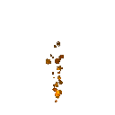
- **Smoke** — source-prefab — [sheet](examples/out/smoke_sheet.png)  
  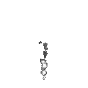
- **Sparks** — source-prefab — [sheet](examples/out/sparks_sheet.png)  
  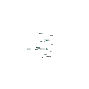
- **Magic** — source-prefab — [sheet](examples/out/magic_sheet.png)  
  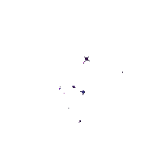
- **Hearts** — source-prefab — [sheet](examples/out/hearts_sheet.png)  
  
- **Electricity** — source-prefab — [sheet](examples/out/electricity_sheet.png)  
  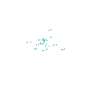
- **Flame jet** — texture-variant — [sheet](examples/out/flame_jet_sheet.png)  
  
- **Star burst** — texture-variant — [sheet](examples/out/star_burst_sheet.png)  
  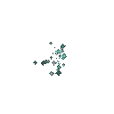
- **Magic swirl** — texture-variant — [sheet](examples/out/magic_swirl_sheet.png)  
  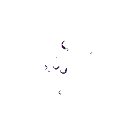
- **Glow orb** — texture-variant — [sheet](examples/out/glow_orb_sheet.png)  
  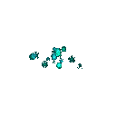

### Resolution comparison (16x16 / 32x32 / 64x64)

**These three columns are derived, not re-renders.** Each cell is an
area/coverage-preserving box downsample of the matching native gallery render: 16x16
takes every 8th pixel of a 128x128 cell (every 12th of the 192x192 pair), 32x32 takes
every 4th (6th) and 64x64 every 2nd (3rd). Colour is averaged alpha-weighted so
coverage and energy survive the reduction, and GIF binary transparency marks a
destination pixel visible when its contributing source block has **any** nonzero alpha —
so a visible native pixel is never dropped. Colour is quantised against a palette built
from the native frames with the manifest's dither. Nothing is re-simulated: seeds, frame
count (25 frames @ 12 fps), timing, framing and colours all come from the native render,
so every column frames exactly the same world region as the gallery GIFs above.

The honest cost of that coverage rule: sparse particles read **thicker at 16x16** than a
native 16x16 render would, rather than fading out. Low-resolution pixelation and density
differences between the columns are expected — they are the thing being compared.

Each file really is 16x16, 32x32 or 64x64 on disk
(`examples/out/<id>_<size>_preview.gif`) — that is conversion from the native render,
not a re-render at that resolution, and each `examples/out/<id>_<size>_render.json`
receipt records it under `derivation` with the method, the integer factor and the
source sheet's sha256.

Each cell is displayed at 64 px so the three sizes line up for comparison. GitHub
strips inline CSS, so no `image-rendering` hint survives: your browser smooths the two
smaller columns as it enlarges them. That softness is the browser's scaling — the
files carry the pixel dimensions named in the column headers.

| Asset | 16x16 | 32x32 | 64x64 |
|---|---|---|---|
| Fire | 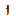 | 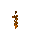 |  |
| Smoke |  |  | 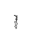 |
| Sparks | 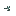 | 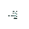 | 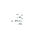 |
| Magic |  |  |  |
| Hearts | 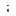 | 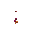 | 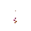 |
| Electricity |  | 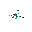 | 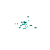 |
| Flame jet | 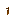 |  |  |
| Star burst |  | 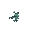 | 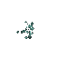 |
| Magic swirl |  |  | 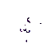 |
| Glow orb |  | 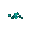 |  |

Matching contact sheets for all 30 cells live beside the GIFs as
`examples/out/<id>_<size>_sheet.png` (regenerate them with the command below). The
ten native 128x128 / 192x192 gallery GIFs and their sheet links above are unchanged and
byte-identical to what this repo already shipped, as is the Kenney Particle Pack
(CC0-1.0) attribution.

### Quick start (sprite pipeline)

Prerequisites: [Bun](https://bun.sh) and Python 3 with Pillow
(`python -m pip install pillow`).

```
# 1. Build tool textures + per-example configs from the shipped normalised records
#    and source sprites (verifies every sprite sha256 pin):
python scripts/import-examples.py

# 2. Render all ten (deterministic; seeds baked into the configs):
bun scripts/render-examples.mjs

# subset / unknown ids (unknown ids exit 2):
bun scripts/render-examples.mjs fire smoke

# 3. Derive the 16x16 / 32x32 / 64x64 comparison cells from the native renders
#    (Windows; area/coverage-preserving box downsample, no re-simulation):
bun scripts/render-resolution-gifs.mjs

# subset of ids:
bun scripts/render-resolution-gifs.mjs fire smoke
```

Outputs: `examples/out/<id>_sheet.png`, `examples/out/<id>_preview.gif`,
`examples/out/<id>_render.json` (receipt incl. a `presentation` block) and
`examples/out/render-summary.json` (per-id exit codes).
`bun scripts/render-resolution-gifs.mjs` then writes the same three artifacts per size
as `examples/out/<id>_<size>_sheet.png`, `<id>_<size>_preview.gif` and
`<id>_<size>_render.json`; each of those receipts carries a `derivation` block naming
the method, the integer downsample factor, the source sheet and GIF sha256, and the
inherited timing and palette settings. To re-derive
`examples/prefabs/*.json` from the original pack instead of the shipped records, run
`python scripts/extract-unity-prefab.py` on the pack zip (URL + sha256 pinned in the
manifest) and pass its output directory: `python scripts/import-examples.py
--extract-dir <dir>`.

### Constraints

- The renderer is a converted, approximate implementation; it does **not** claim pixel
  parity with Unity or native vendor rendering.
- Presentation overrides are explicit and labelled, never presented as source values:
  `view.startSize` presentation overrides
  cover legibility and degenerate sources alike: Magic, Magic swirl and Hearts scale
  their source size ranges up for gallery legibility, and Electricity and Glow orb use
  `1.0` because the source prefab serialises a degenerate constant size `0.0`. Every
  override is recorded in its receipt as `presentation.startSizeOverride` with the
  original value, and labelled in the manifest `notes`. Original records stay untouched
  in `examples/<id>.json` and `examples/prefabs/*.json`.
- Prefab root translation is sample-scene placement and is ignored by the renderer; the
  per-example origin carries framing (`presentation.rootTranslationIgnored` in every
  receipt).
- The 16x16 / 32x32 / 64x64 comparison cells are **derived by
  area/coverage-preserving downsample** of the native renders, as documented in the
  resolution comparison section — conversion, not re-simulation. The native 128x128 /
  192x192 gallery GIFs and sheets are untouched and byte-identical to what this repo
  already shipped; no renderer code changed for them.
- Deterministic: baked seeds, fixed frame count/fps/palette — a regeneration from the
  same inputs yields the same bytes.
- No Unity editor is required for the default flow; no vendor demo data or paid pack
  content is included (CC0 pack, pinned download).
- `examples/textures/` and the machine-specific render receipts
  (`examples/out/*_render.json`, `examples/out/render-summary.json` — Windows absolute
  paths) are generated locally and excluded from the public set; the published gallery
  outputs are the preview GIFs and contact-sheet PNGs linked above (regenerable
  byte-identically from this repository).

## Tests

```
bun test
```

Golden determinism fixture: `bun run scripts/gen-golden.mjs` regenerates
`tests/golden.json`; `bun test` verifies every run against it. Windows end-to-end UI
validation: `node scripts\win-verify.mjs` (109 checks, headless Chrome CDP, evidence under
`evidence/`).

## Layout

- `index.html` — UI shell (controls, stage, transport, holds/markers, log)
- `src/rng.js` — seeded RNG (FNV-1a + mulberry32)
- `src/mathx.js` — engine-independent trig (deterministic across JS engines)
- `src/effects.js` — 10 original 2D presets (bursts/trails + looping ambient)
- `src/sim.js` — fixed-timestep particle simulation (1/120 s), respawn for loops
- `src/raster.js` — software rasterizer (dot/streak/blob/ring/arc/bolt), camera transform
- `src/camera3d.js` — column-major mat4, perspective, lookAt, orbit view, projection
- `src/geometry.js` — box/sphere/torus/cone/plane meshes + cache
- `src/render3d.js` — flat-shaded software rasterizer with z-buffer (meshes + billboards)
- `src/post3d.js` — HDR bright-pass bloom + 3-pass alpha matte (coverage/dilate/edge)
- `src/effects3d.js` — 6 original 3D presets, pure `scene(t, seed)`
- `src/frame3d.js` — 3D frame orchestration into RGBA output
- `src/pixel.js` — alpha threshold, gradient-LUT recolor, median-cut palette, Bayer dither, outline
- `src/timing.js` — holds, frame-range repair, markers, totals
- `src/sheet.js` — near-square sprite-sheet layout
- `src/pngenc.js` — PNG encoder (stored-deflate + CRC32) and structural parser
- `src/gifenc.js` — GIF89a encoder (own LZW) and structural parser
- `src/pipeline.js` — sanitize → render sequence → quantize → export glue (sheet, GIF,
  frame, atlas, Aseprite, .tres, .meta)
- `src/app.js` — UI wiring, playback, orbit gestures, markers, exports, `window.PixelVFX`
  automation surface
- `scripts/mcp-server.mjs` — MCP stdio server
- `scripts/serve.py` + `scripts/launch-desktop.cmd/.ps1` — token-gated desktop shell
- `scripts/win-verify.mjs` — Windows end-to-end driver (headless Chrome CDP)
- `scripts/import-examples.py` — build textures + configs from shipped records/pins
- `scripts/render-examples.mjs` — batch renderer CLI (id validation, run summary)
- `scripts/render-unity-asset.mjs` — converted particle renderer (sheet/GIF/receipt)
- `examples/` — manifest, ten configs, source sprites, normalised prefab records, gallery GIFs
- `tests/` — bun test suite incl. golden-hash regression
