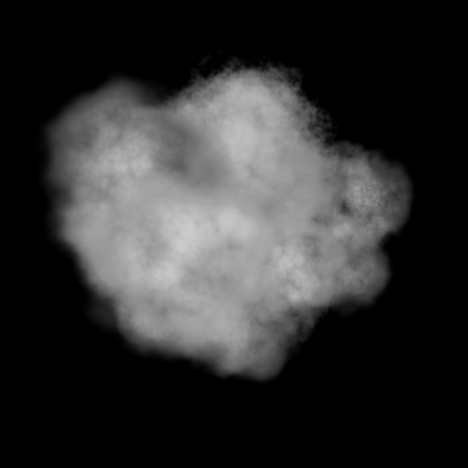
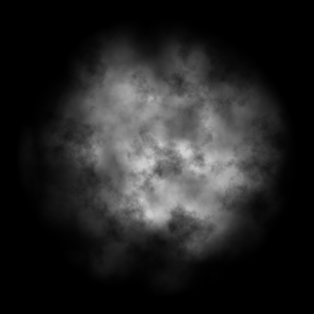
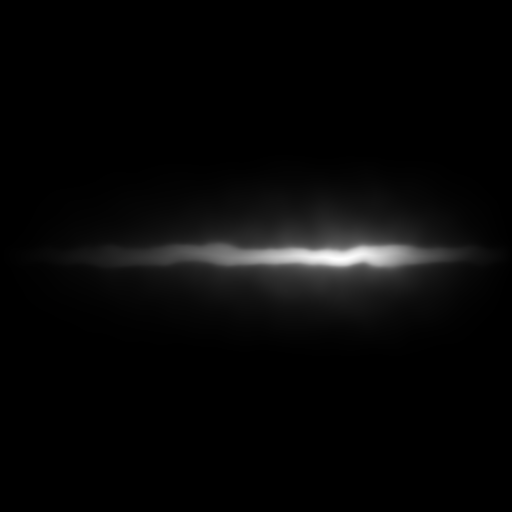
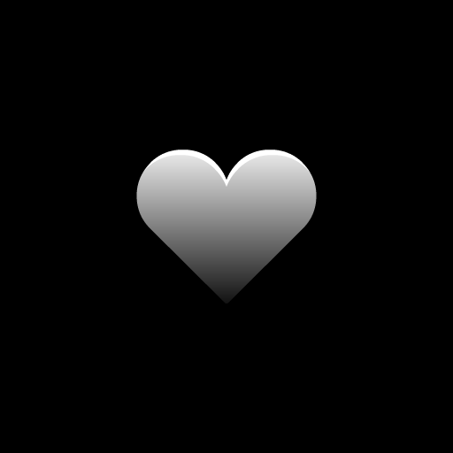
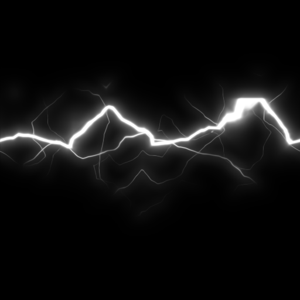
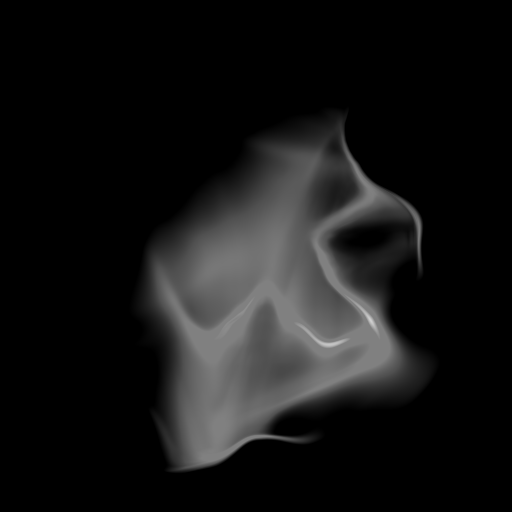
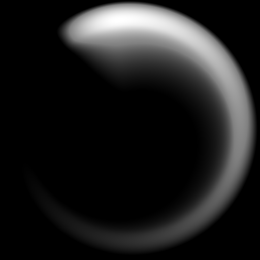
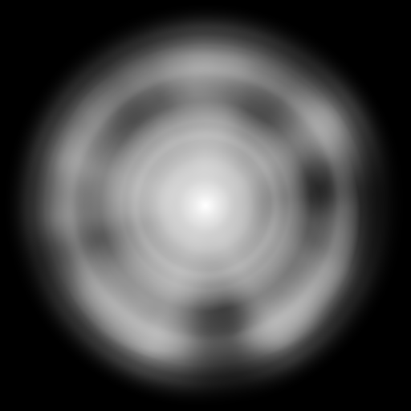

# pixel-vfx-local

Original local pixel-art VFX editor: live effect preview, playback/scrubbing, seeded
deterministic effects, 2D camera controls, a real 3D workflow (orbit camera, procedural
geometry, software z-buffer renderer, HDR bloom + 3-pass alpha matting post), output
resolution/fps/frame-range, palette quantization + dither + outline + recolor, per-frame
timing holds, **editable timing markers**, PNG sprite-sheet / GIF / **Aseprite .aseprite** /
**Godot .tres** / **Unity .meta** export, an **MCP stdio control server**, and a
**token-gated desktop shell**. Zero runtime dependencies (plain ES modules + Canvas 2D;
all encoders are bundled original implementations).

This is an original implementation built from a feature checklist (see `PARITY.md`).
No vendor source, shaders, textures, meshes, or effect data from the inspected demo are
included. All 21 presets — 16 original procedural effects (10 2D + 6 3D) plus 5
quality presets (slash / flame / impact / smoke / magic-ring) — are original content.

## Export fps limits (per format)

- **Playback, PNG sheet, frame, atlas, Aseprite, .tres, .meta exports:** fps **1–60** as
  entered.
- **GIF export:** every encoded frame delay must be **≥ 2 centiseconds** (the encoder
  floor). Legacy scalar-delay presets clamp the delay up to 2 cs (so fps > 50 plays
  slightly slower than nominal). Boundary-scheduled **quality presets do not clamp**: GIF
  at fps **51–60 is unsupported and fails explicitly** with `delaySchedule=boundary:
  fps=… yields a sub-2cs delay at the encoder floor; unsupported candidate fps` (MCP
  returns JSON-RPC error `-32000`; the editor shows the message and this guidance in the
  export log). Use **fps ≤ 50** for quality-preset GIFs; sheet/frame exports stay valid
  at fps ≤ 60.

## Launch (Windows)

Desktop shell (recommended): `scripts\launch-desktop.cmd` starts the token-gated local
server and opens an app window pointed at it with the session token. The server
(`scripts/serve.py`) returns 403 without `?t=<token>` and serves subsequent files from an
HttpOnly session cookie; directory listing is disabled.

Plain static serving (no token gate) also works:

```
python -m http.server 8123 --bind 127.0.0.1
```

then open <http://127.0.0.1:8123/>.

## 3D workflow

Pick a preset labeled `(3D)` (Shard Burst, Orbital Ring, Crystal Growth, Nebula Swarm,
Warp Tunnel, Gem Spin). The Camera 3D section appears: yaw/pitch/distance/FOV sliders,
drag the preview canvas to orbit, use the wheel to zoom. 3D frames flow through the same
capture path as 2D (palette quantize, outline, holds, frame range) into sheet/GIF/Aseprite
exports.

## Editable timing markers

In the Timing section, set a frame number and optional label, press "Add marker".
Markers are sorted, clipped to 40 chars, capped at 32, removable from the list, and are
exported in the Atlas JSON under `meta.userMarkers` alongside the auto-suggested markers.

## MCP control server

```
bun scripts/mcp-server.mjs
```

Newline-delimited JSON-RPC 2.0 over stdio: `initialize`, `tools/list`, `tools/call` with
`list_presets`, `render_sheet`, `render_gif`, `golden_hashes`.

## Sourced sprite gallery

Ten examples render real source assets through the converted renderer: six original
sample-prefab / texture pairs (`source-prefab`) and four texture variants that pair a
recorded motion with a different pack sprite (`source-texture-variant`), each rendered
with the documented presentation adjustments described under Constraints. Each entry
links its preview GIF and its full contact sheet PNG under `examples/out/`.
All sprites are
from the **Kenney Particle Pack** by Kenney Vleugels (kenney.nl), **CC0-1.0** — see
`examples/LICENSE-Kenney-Particle-Pack.txt`; pack URL + zip sha256 are pinned in
`examples/manifest.json` (`pack`).

| Example | Kind | Motion record | Sprite |
|---|---|---|---|
| Fire | source-prefab | [Fire.json](examples/prefabs/Fire.json) | [smoke_07.png](examples/src-sprites/smoke_07.png) |
| Smoke | source-prefab | [Smoke.json](examples/prefabs/Smoke.json) | [smoke_01.png](examples/src-sprites/smoke_01.png) |
| Sparks | source-prefab | [Sparks.json](examples/prefabs/Sparks.json) | [trace_02_rotated.png](examples/src-sprites/trace_02_rotated.png) |
| Magic | source-prefab | [Magic.json](examples/prefabs/Magic.json) | [star_06.png](examples/src-sprites/star_06.png) |
| Hearts | source-prefab | [Hearts.json](examples/prefabs/Hearts.json) | [symbol_01.png](examples/src-sprites/symbol_01.png) |
| Electricity | source-prefab | [Electricity.json](examples/prefabs/Electricity.json) | [spark_05_rotated.png](examples/src-sprites/spark_05_rotated.png) |
| Flame jet | texture-variant | Fire motion | [flame_03.png](examples/src-sprites/flame_03.png) |
| Star burst | texture-variant | Sparks motion | [star_01.png](examples/src-sprites/star_01.png) |
| Magic swirl | texture-variant | Magic motion | [twirl_01.png](examples/src-sprites/twirl_01.png) |
| Glow orb | texture-variant | Electricity motion | [light_01.png](examples/src-sprites/light_01.png) |

- **Fire** — source-prefab — [sheet](examples/out/fire_sheet.png)  
  
- **Smoke** — source-prefab — [sheet](examples/out/smoke_sheet.png)  
  
- **Sparks** — source-prefab — [sheet](examples/out/sparks_sheet.png)  
  
- **Magic** — source-prefab — [sheet](examples/out/magic_sheet.png)  
  
- **Hearts** — source-prefab — [sheet](examples/out/hearts_sheet.png)  
  
- **Electricity** — source-prefab — [sheet](examples/out/electricity_sheet.png)  
  
- **Flame jet** — texture-variant — [sheet](examples/out/flame_jet_sheet.png)  
  
- **Star burst** — texture-variant — [sheet](examples/out/star_burst_sheet.png)  
  
- **Magic swirl** — texture-variant — [sheet](examples/out/magic_swirl_sheet.png)  
  
- **Glow orb** — texture-variant — [sheet](examples/out/glow_orb_sheet.png)  
  

### Resolution comparison (16x16 / 32x32 / 64x64)

**These three columns are derived, not re-renders.** Each cell is an
area/coverage-preserving box downsample of the matching native gallery render: 16x16
takes every 8th pixel of a 128x128 cell (every 12th of the 192x192 pair), 32x32 takes
every 4th (6th) and 64x64 every 2nd (3rd). Colour is averaged alpha-weighted so
coverage and energy survive the reduction, and GIF binary transparency marks a
destination pixel visible when its contributing source block has **any** nonzero alpha —
so a visible native pixel is never dropped. Colour is quantised against a palette built
from the native frames with the manifest's dither. Nothing is re-simulated: seeds, frame
count (25 frames @ 12 fps), timing, framing and colours all come from the native render,
so every column frames exactly the same world region as the gallery GIFs above.

The honest cost of that coverage rule: sparse particles read **thicker at 16x16** than a
native 16x16 render would, rather than fading out. Low-resolution pixelation and density
differences between the columns are expected — they are the thing being compared.

Each file really is 16x16, 32x32 or 64x64 on disk
(`examples/out/<id>_<size>_preview.gif`) — that is conversion from the native render,
not a re-render at that resolution, and each `examples/out/<id>_<size>_render.json`
receipt records it under `derivation` with the method, the integer factor and the
source sheet's sha256.

Each cell is displayed at 64 px so the three sizes line up for comparison. GitHub
strips inline CSS, so no `image-rendering` hint survives: your browser smooths the two
smaller columns as it enlarges them. That softness is the browser's scaling — the
files carry the pixel dimensions named in the column headers.

| Asset | 16x16 | 32x32 | 64x64 |
|---|---|---|---|
| Fire |  |  |  |
| Smoke |  |  |  |
| Sparks |  |  |  |
| Magic |  |  |  |
| Hearts |  |  |  |
| Electricity |  |  |  |
| Flame jet |  |  |  |
| Star burst |  |  |  |
| Magic swirl |  |  |  |
| Glow orb |  |  |  |

Matching contact sheets for all 30 cells live beside the GIFs as
`examples/out/<id>_<size>_sheet.png` (regenerate them with the command below). The
ten native 128x128 / 192x192 gallery GIFs and their sheet links above are unchanged and
byte-identical to what this repo already shipped, as is the Kenney Particle Pack
(CC0-1.0) attribution.

### Quick start (sprite pipeline)

Prerequisites: [Bun](https://bun.sh) and Python 3 with Pillow
(`python -m pip install pillow`).

```
# 1. Build tool textures + per-example configs from the shipped normalised records
#    and source sprites (verifies every sprite sha256 pin):
python scripts/import-examples.py

# 2. Render all ten (deterministic; seeds baked into the configs):
bun scripts/render-examples.mjs

# subset / unknown ids (unknown ids exit 2):
bun scripts/render-examples.mjs fire smoke

# 3. Derive the 16x16 / 32x32 / 64x64 comparison cells from the native renders
#    (Windows; area/coverage-preserving box downsample, no re-simulation):
bun scripts/render-resolution-gifs.mjs

# subset of ids:
bun scripts/render-resolution-gifs.mjs fire smoke
```

Outputs: `examples/out/<id>_sheet.png`, `examples/out/<id>_preview.gif`,
`examples/out/<id>_render.json` (receipt incl. a `presentation` block) and
`examples/out/render-summary.json` (per-id exit codes).
`bun scripts/render-resolution-gifs.mjs` then writes the same three artifacts per size
as `examples/out/<id>_<size>_sheet.png`, `<id>_<size>_preview.gif` and
`<id>_<size>_render.json`; each of those receipts carries a `derivation` block naming
the method, the integer downsample factor, the source sheet and GIF sha256, and the
inherited timing and palette settings. To re-derive
`examples/prefabs/*.json` from the original pack instead of the shipped records, run
`python scripts/extract-unity-prefab.py` on the pack zip (URL + sha256 pinned in the
manifest) and pass its output directory: `python scripts/import-examples.py
--extract-dir <dir>`.

### Constraints

- The renderer is a converted, approximate implementation; it does **not** claim pixel
  parity with Unity or native vendor rendering.
- Presentation overrides are explicit and labelled, never presented as source values:
  `view.startSize` presentation overrides
  cover legibility and degenerate sources alike: Magic, Magic swirl and Hearts scale
  their source size ranges up for gallery legibility, and Electricity and Glow orb use
  `1.0` because the source prefab serialises a degenerate constant size `0.0`. Every
  override is recorded in its receipt as `presentation.startSizeOverride` with the
  original value, and labelled in the manifest `notes`. Original records stay untouched
  in `examples/<id>.json` and `examples/prefabs/*.json`.
- Prefab root translation is sample-scene placement and is ignored by the renderer; the
  per-example origin carries framing (`presentation.rootTranslationIgnored` in every
  receipt).
- The 16x16 / 32x32 / 64x64 comparison cells are **derived by
  area/coverage-preserving downsample** of the native renders, as documented in the
  resolution comparison section — conversion, not re-simulation. The native 128x128 /
  192x192 gallery GIFs and sheets are untouched and byte-identical to what this repo
  already shipped; no renderer code changed for them.
- Deterministic: baked seeds, fixed frame count/fps/palette — a regeneration from the
  same inputs yields the same bytes.
- No Unity editor is required for the default flow; no vendor demo data or paid pack
  content is included (CC0 pack, pinned download).
- `examples/textures/` and the machine-specific render receipts
  (`examples/out/*_render.json`, `examples/out/render-summary.json` — Windows absolute
  paths) are generated locally and excluded from the public set; the published gallery
  outputs are the preview GIFs and contact-sheet PNGs linked above (regenerable
  byte-identically from this repository).

These 30 cells are the **historical** conversion baseline for the ten shipped examples;
they are **not** the quality-v1 acceptance output. See
[Comparison against the originals (honest status)](#comparison-against-the-originals-honest-status).

## Comparison against the originals (honest status)

The owner reference for this project is the **hun0fx Pixel Studio** generator — not the
Kenney textures. Three different comparisons are easy to conflate, so they are kept in
separate tables. **No row below is a similarity pass, a parity claim, or an art
acceptance**: every row ends with the status the evidence actually supports.

**Independent visual verdict (Astra, 2026-10-07):** *"The current authored outputs
resemble the originals only at broad effect-class level. They are not close visual
reproductions of the inspected hun0fx effects."* The report allows this section to be
published as an **explicitly intermediate comparison**, and states it is *"not honestly
COMPLETE as the owner's requested final original-versus-output comparison."*

**Same-class is not fidelity.** Slash, fire and burst resemblance is a class observation,
never a conversion result, a pixel-error result or a parity result. No similarity
percentage and no PASS is claimed anywhere in this section, and this section is
**INTERMEDIATE — not final, not a pass.**

### Current quality-v1 outputs at 16 / 32 / 64 (UNACCEPTED / INTERMEDIATE — not final)

These are the project's **current** outputs: the authored `quality_*` presets rendered at
16, 32 and 64 px. Every image below is a byte-identical copy of an existing,
provenance-recorded render — nothing was re-rendered, re-tuned or re-encoded for this
table, and the copy manifest (source directory, exact revision, sha256 per file) is
[examples/comparison/quality/PROVENANCE.md](examples/comparison/quality/PROVENANCE.md).

**Art status: UNACCEPTED / INTERMEDIATE.** This table is not a quality gate, not a
publication approval, not a pass and not "final": G0–G4, real Windows playback
verification and M5 reconciliation remain open, and two of the five presets have no
16/32/64 render at all. A missing size is labelled **missing** — no placeholder is
substituted, and no original-effect thumbnail is fabricated anywhere in this section.

| Preset | Exact render revision | Scoped checkpoint record — **not resemblance, not final** | 16 | 32 | 64 | Frame sheets 16 / 32 / 64 |
|---|---|---|---|---|---|---|
| `quality_slash` (0.50 s one-shot) | `m3-slash-rev1-20261006` (R1) | Scoped M3 art checkpoint closed for this revision; independent resemblance verdict is **negative**; **not** publication approval |  |  |  | [16](examples/comparison/quality/quality_slash-rev1/16/sheet.png) [32](examples/comparison/quality/quality_slash-rev1/32/sheet.png) [64](examples/comparison/quality/quality_slash-rev1/64/sheet.png) |
| `quality_flame` (2.00 s loop) | `m3-flame-rev2-20261006` (R2) | **HOLD** — final all-size art acceptance held; both directed revisions used; resemblance verdict **weak** |  |  |  | [16](examples/comparison/quality/quality_flame-rev2/16/sheet.png) [32](examples/comparison/quality/quality_flame-rev2/32/sheet.png) [64](examples/comparison/quality/quality_flame-rev2/64/sheet.png) |
| `quality_impact` (0.75 s one-shot) | `m3-impact-rev2-20261006` (R2) | Scoped M3 art checkpoint closed for this revision; independent resemblance verdict is **negative** (generic burst only); **not** publication approval |  |  |  | [16](examples/comparison/quality/quality_impact-rev2/16/sheet.png) [32](examples/comparison/quality/quality_impact-rev2/32/sheet.png) [64](examples/comparison/quality/quality_impact-rev2/64/sheet.png) |
| `quality_smoke` (1.50 s one-shot) | **none — no 16/32/64 render exists** | **MISSING** — recomposition deferred | **missing** | **missing** | **missing** | **missing** |
| `quality_magic_ring` (2.00 s loop) | **none — no 16/32/64 render exists** | **MISSING** — never rendered at these sizes | **missing** | **missing** | **missing** | **missing** |

The ten shipped gallery examples (`examples/out/*_16/32/64_preview.gif`) are a
**separate, historical** conversion baseline and are documented in the *Resolution
comparison* section above. They are preserved there unchanged and are deliberately not
mixed into this table.

### A. Vendor reference vs our same-class effects (different inputs, not matched)

No vendor frame, recording, texture or screenshot is published in this repository. The
reason is specific rather than blanket, and it comes from reading the licence clauses
rather than from a single clause alone. The demo licence (`hun0fx Pixel Studio`, End User
Licence) separates three things:

- **Clause 3a — extracted Library content:** *"Extract, copy, decode or redistribute the
  Library or any part of it (including the data pack, textures, meshes, effect
  definitions and shaders), or use it outside the Software."* Our captures are of the
  Library being rendered by the demo, so publishing them would redistribute Library
  content. **No redistribution basis — the captures stay private.**
- **Clause 6 — demo Output:** *"The free demo may be used to try the Software only.
  Output exported from the demo may not be used in released or commercial projects; buy
  the full version for that."* This restricts the **use** of demo Output in released or
  commercial projects. It is **not** a blanket prohibition on displaying a reference
  image, and it is not on its own the reason the reference column below is empty.
- **Clause 2 — Output licence (for contrast):** *"Sprite sheets, frames, GIFs, Aseprite
  files and engine import files exported from the Software (\"Output\") may be used,
  modified and sold as part of your own games, apps, videos and other creative projects,
  commercial or not, with no royalties and no credit required."* — the general Output
  licence; demo Output is narrowed by clause 6.

Vendor **promotional screenshots** are a third category: they are published by the vendor
on their own pages, not extracted by us. **What the clauses do and do not establish:**
they establish that the **Library** may not be extracted or redistributed (3a), and that
**Output exported from the demo** may not be used in released or commercial projects (6).
They do **not** expressly classify every UI screenshot as demo-exported Output, and
they say nothing about linking to the vendor's own public promotional material. Absence of
an express screenshot clause is **not** permission to redistribute vendor media either.
No legal conclusion is claimed in either direction, so the working rule is the
conservative one:

> Private demo captures are not redistributed in this packet; see the official product
> demonstration. Permission for any inline promotional reference has not been
> established.

Accordingly the original reference is supplied as an **attributed link to the official
vendor product page**, not as an inline image: no original thumbnail is reproduced,
fabricated or hotlinked here, because no verified exact-effect promotional still or
timestamp has been established.

**Reference inventory (private — not files in this repository):**

| Vendor reference | Demo UI settings read at capture (2026-10-05) | Source catalogue (`demo.pak`) | Paused-frame capture | Live-playback capture |
|---|---|---|---|---|
| `Slash_fire` (Slash) | 15 frames @ 15 fps = 1.00 s timeline; 64x64, 16 colours, seed 1, 75 deg | duration 0.77 s, one-shot | 10 x 3858x1558 PNG, 11:13 UTC | 217 frames, 1850x1126 @ 30 fps, 15:49 UTC |
| `Fire_03` (Fire) | 24 frames @ 15 fps = 1.60 s timeline; 64x64, 16 colours, seed 1, 45 deg | loop, no fixed duration | 10 x 3858x1558 PNG, 11:13 UTC | 239 frames, 1850x1126 @ 30 fps, 15:00 UTC |
| `Blast_Electricity_01` (Blast) | 18 frames @ 15 fps = 1.20 s timeline; 64x64, 16 colours, seed 1, 45 deg | duration 0.98 s, one-shot | 10 x 3858x1558 PNG, 11:13 UTC | 236 frames, 1850x1126 @ 30 fps, 16:11 UTC |
| `Combo_FrostNova` (Blast) | 55 frames @ 15 fps = 3.67 s timeline; 64x64, 16 colours, seed 1, 45 deg | duration 3.48 s | 12 x 3858x1558 PNG, 11:13 UTC | not recorded |

The UI-encoded timeline (1.00 / 1.60 / 1.20 / 3.67 s) and the source catalogue
duration (0.77 / — / 0.98 / 3.48 s) are **different numbers and are not conflated**;
every comparison below quotes the UI-encoded timeline.

Camera, size and licence: the paused frames are window-region screenshots of the demo's
**processed 64 px checkerboard preview at 4x UI zoom** (display 3840x1600 at 125% DPI,
window rect -9,-9, 3858x1558; task-owned helper, 250 ms sampling — 300 ms for the frost
set). The recordings are 1850x1126 H.264/yuv420p at 30 fps, region origin (995, 207),
with one row padded for encoding. **Licence: none granted — private receipts only.**

| Original reference | Reference visual / public source | Our same-class effect — current 16 / 32 / 64 | Input and render path | Timing, size and conversion limits | Similarity status |
|---|---|---|---|---|---|
| `Slash_fire` — 15 f @ 15 fps (1.00 s UI timeline), one-shot, 75 deg, seed 1 | **Not redistributed in this packet** — see the licence note above. Attributed official demonstration: [hun0fx Pixel Studio — Pixel Art VFX Generator](https://hun0fx.itch.io/pixel-art-vfx-generator) (no inline original image: exact effect/timestamp not verified) | **Current** `quality_slash` R1, 0.50 s one-shot:    (16 / 32 / 64 — UNACCEPTED / INTERMEDIATE) | Vendor: demo UI capture. Ours: authored layers (`src/quality-effects.js`) through `src/quality-render.js` — **no vendor input of any kind** | Different effect definitions; no shared seed or parameter set. 15 f @ 15 fps (1.00 s) vs 0.50 s @ 12 fps (6 samples). Vendor preview/export size is 64 px; our cells are 16/32/64 | **UNVERIFIED** — no matched input, no native baseline, no published side-by-side |
| `Fire_03` — 24 f @ 15 fps (1.60 s UI timeline), loop, 45 deg, seed 1 | **Not redistributed in this packet.** Same attributed official product page | **Current** `quality_flame` R2, 2.00 s loop:    (16 / 32 / 64, **HOLD**). Legacy conversion baseline, kept separately: `fire` [16](examples/out/fire_16_preview.gif) [32](examples/out/fire_32_preview.gif) [64](examples/out/fire_64_preview.gif); `flame_jet` [16](examples/out/flame_jet_16_preview.gif) [32](examples/out/flame_jet_32_preview.gif) [64](examples/out/flame_jet_64_preview.gif) | Ours: Unity `Fire.prefab` record converted by `scripts/render-unity-asset.mjs`, then box-downsampled by `scripts/render-resolution-gifs.mjs` | 24 f @ 15 fps (1.60 s) vs our 25 f @ 12 fps (2.08 s). The 16/32/64 cells are **derived downsamples**, not renders made at those sizes | **UNVERIFIED — class-level only** (both are fire; different assets, parameters, RNG and timing) |
| `Blast_Electricity_01` — 18 f @ 15 fps (1.20 s UI timeline), one-shot, 45 deg, seed 1 | **Not redistributed in this packet.** Same attributed official product page | **Current** `quality_impact` R2, 0.75 s one-shot:    (16 / 32 / 64). Legacy conversion baseline, kept separately: `electricity` [16](examples/out/electricity_16_preview.gif) [32](examples/out/electricity_32_preview.gif) [64](examples/out/electricity_64_preview.gif) | Ours: Unity `Electricity.prefab` record converted, then box-downsampled | 18 f @ 15 fps (1.20 s) vs our 25 f @ 12 fps (2.08 s); derived cells vs a native render | **UNVERIFIED — class-level only** (both are electricity; different assets, parameters, RNG and timing) |

`quality_smoke` (1.50 s one-shot) and `quality_magic_ring` (2.00 s loop) appear in **no**
row above: the capture scope was slash / fire / blast, so those two have **no vendor
reference at all**.

#### What independent visual review actually found (Astra, 2026-10-07)

Read-only review of the private playback contact sheets beside our current sheets. The
verdict is negative on resemblance, and it is recorded here verbatim in substance:

| Pair | Resemblance verdict | Concrete gap |
|---|---|---|
| `Slash_fire` vs `quality_slash` | **Broad slash resemblance only** | Reference: large red/orange curved blade, bright yellow outer edge, dark red internal texture, breaking into ragged hot fragments. Ours: clean cyan upper arch with violet start and pale terminal tip, comparatively stable through later samples. Hue family, arc coverage/orientation, surface texture and decay choreography differ; the broken fiery tail is absent. |
| `Fire_03` vs `quality_flame` | **Recognizable fire, weak resemblance to this specific `Fire_03`** | Reference: bright near-white/yellow core with curling yellow/orange/red streaks whose outline changes substantially. Ours: an upright compact stylized flame emblem that reads comparatively stable. White-hot area, red range, peripheral structure and degree of shape change differ. |
| `Blast_Electricity_01` vs `quality_impact` | **Only generic burst/impact resemblance — not an electrical fidelity match** | Reference: cyan/white jagged irregular discharge with branching bolts that breaks into sparse streaks. Ours: an orange regular spoke burst around a ring. Different phenomenon and colour language; branching, asymmetry, fractured rim and bolt travel are absent. Calling both "electricity" would misdescribe our impact. |

Resolution behaviour: at **16** the three outputs stay identifiable but fine distinctions
disappear (slash tip detail, impact spokes, flame valley separation); at **32** basic
forms separate more clearly; at **64** the extra resolution mostly exposes their cleaner
geometric construction rather than making them closer to the vendor's textured,
fragmenting treatment. This is not a readability guarantee against gameplay backgrounds.

**Timing and evidence limits.** Our manifests record slash **0.50 s**, impact **0.75 s**
and flame **2.00 s loop**, all at **12 fps**. Vendor UI timelines are slash **15 frames @
15 fps (1.00 s)**, electricity **18 @ 15 fps (1.20 s)**, fire **24 @ 15 fps (1.60 s)**;
catalogue durations (0.77 / 0.98 / …) are separate and must not replace UI timing. A
declared total duration does not describe active effect duration, and our one-shot
slash/impact GIFs may replay as previews — **repeating GIF playback must not be confused
with an intrinsically looping effect** (only `quality_flame` has explicit loop intent).
The ordered samples support observations about filled shape, breakup and sparse tail;
they do **not** establish perceived smoothness, temporal punch, loop comfort or
phase-aligned timing fidelity, and **no real-time motion PASS is issued**. Capture PTS
includes pre-play holds and repeated display frames, so repeated contact-sheet images are
not proof of a defective source animation. No native vendor 16/32 output was inspected,
so our 16/32 readability can be discussed but **not** same-resolution vendor fidelity.

### B. Public Unity source prefab vs converted output

Only a native Unity render of the same prefab can establish conversion fidelity, and
**no such render exists**: neither host has a Unity Editor installed (macOS
`/Applications/Unity*` is empty; Windows `Program Files\Unity`,
`Program Files\Unity Hub` and `%LOCALAPPDATA%\Unity` are absent). Every row in this lane
is therefore **unverified**, not passing.

Source and licence: the **Kenney Particle Pack** by Kenney Vleugels, **CC0-1.0**
(`examples/LICENSE-Kenney-Particle-Pack.txt`) — a real Unity
`particlePack_samples.unitypackage`. The six `source-prefab` rows carry the normalised
record of that prefab (`examples/prefabs/<Name>.json`, source path plus pack URL and zip
sha256 pinned in `examples/manifest.json`), and every sprite is the pack's own texture.
**CC0 gives a redistribution basis, so the reference visuals are published below.**

Shared input and render path for all ten rows:
`python scripts/extract-unity-prefab.py` (pack zip) → `examples/prefabs/*.json` →
`python scripts/import-examples.py` (texture + config, every sprite sha256 verified) →
`bun scripts/render-unity-asset.mjs` (native 128x128, or 192x192 for Magic and Magic
swirl; 25 frames @ 12 fps, palette 16, dither bayer4, alpha threshold 0.28) →
`bun scripts/render-resolution-gifs.mjs` (the derived 16/32/64 cells).

Shared timing, size and conversion limits: the renderer is an approximate conversion that
**never runs Unity**; presentation overrides are recorded per receipt
(`presentation.startSizeOverride`, `presentation.rootTranslationIgnored`); prefab root
translation is ignored as sample-scene placement; the 16/32/64 cells are downsamples of
the native render, so sparse particles read **thicker at 16x16** than a native 16x16
render would.

| Ours (converted example) | Original source — visual + record (CC0-1.0) | Current 16 / 32 / 64 | What the source actually gives us | Fidelity status |
|---|---|---|---|---|
| **Fire** (`source-prefab`) |  [smoke_07.png](examples/src-sprites/smoke_07.png) · [Fire.json](examples/prefabs/Fire.json) | [16](examples/out/fire_16_preview.gif) [32](examples/out/fire_32_preview.gif) [64](examples/out/fire_64_preview.gif) | Full Unity `Fire.prefab`: emitter, lifetime, speed, size, rotation, colour-over-lifetime, shape and emission, plus its own material texture | **UNVERIFIED — no native Unity baseline** |
| **Smoke** (`source-prefab`) |  [smoke_01.png](examples/src-sprites/smoke_01.png) · [Smoke.json](examples/prefabs/Smoke.json) | [16](examples/out/smoke_16_preview.gif) [32](examples/out/smoke_32_preview.gif) [64](examples/out/smoke_64_preview.gif) | Full Unity `Smoke.prefab` plus its own material texture | **UNVERIFIED — no native Unity baseline** |
| **Sparks** (`source-prefab`) |  [trace_02_rotated.png](examples/src-sprites/trace_02_rotated.png) · [Sparks.json](examples/prefabs/Sparks.json) | [16](examples/out/sparks_16_preview.gif) [32](examples/out/sparks_32_preview.gif) [64](examples/out/sparks_64_preview.gif) | Full Unity `Sparks.prefab` plus its own material texture | **UNVERIFIED — no native Unity baseline** |
| **Magic** (`source-prefab`) |  [star_06.png](examples/src-sprites/star_06.png) · [Magic.json](examples/prefabs/Magic.json) | [16](examples/out/magic_16_preview.gif) [32](examples/out/magic_32_preview.gif) [64](examples/out/magic_64_preview.gif) | Full Unity `Magic.prefab` plus its own material texture | **UNVERIFIED — no native Unity baseline** |
| **Hearts** (`source-prefab`) |  [symbol_01.png](examples/src-sprites/symbol_01.png) · [Hearts.json](examples/prefabs/Hearts.json) | [16](examples/out/hearts_16_preview.gif) [32](examples/out/hearts_32_preview.gif) [64](examples/out/hearts_64_preview.gif) | Full Unity `Hearts.prefab` plus its own material texture | **UNVERIFIED — no native Unity baseline** |
| **Electricity** (`source-prefab`) |  [spark_05_rotated.png](examples/src-sprites/spark_05_rotated.png) · [Electricity.json](examples/prefabs/Electricity.json) | [16](examples/out/electricity_16_preview.gif) [32](examples/out/electricity_32_preview.gif) [64](examples/out/electricity_64_preview.gif) | Full Unity `Electricity.prefab` plus its own material texture | **UNVERIFIED — no native Unity baseline** |
| **Flame jet** (`texture-variant`) |  [flame_03.png](examples/src-sprites/flame_03.png) · motion: [Fire.json](examples/prefabs/Fire.json) | [16](examples/out/flame_jet_16_preview.gif) [32](examples/out/flame_jet_32_preview.gif) [64](examples/out/flame_jet_64_preview.gif) | **Texture only** for this pairing: the sprite is `flame_03.png`, the motion record belongs to Fire. **A texture is not a source animation**, so this pairing has no native equivalent | **UNVERIFIED — no native source equivalent for this pairing** |
| **Star burst** (`texture-variant`) |  [star_01.png](examples/src-sprites/star_01.png) · motion: [Sparks.json](examples/prefabs/Sparks.json) | [16](examples/out/star_burst_16_preview.gif) [32](examples/out/star_burst_32_preview.gif) [64](examples/out/star_burst_64_preview.gif) | **Texture only** for this pairing: sprite `star_01.png`, motion record is Sparks'. A texture is not a source animation | **UNVERIFIED — no native source equivalent for this pairing** |
| **Magic swirl** (`texture-variant`) |  [twirl_01.png](examples/src-sprites/twirl_01.png) · motion: [Magic.json](examples/prefabs/Magic.json) | [16](examples/out/magic_swirl_16_preview.gif) [32](examples/out/magic_swirl_32_preview.gif) [64](examples/out/magic_swirl_64_preview.gif) | **Texture only** for this pairing: sprite `twirl_01.png`, motion record is Magic's. A texture is not a source animation | **UNVERIFIED — no native source equivalent for this pairing** |
| **Glow orb** (`texture-variant`) |  [light_01.png](examples/src-sprites/light_01.png) · motion: [Electricity.json](examples/prefabs/Electricity.json) | [16](examples/out/glow_orb_16_preview.gif) [32](examples/out/glow_orb_32_preview.gif) [64](examples/out/glow_orb_64_preview.gif) | **Texture only** for this pairing: sprite `light_01.png`, motion record is Electricity's. A texture is not a source animation | **UNVERIFIED — no native source equivalent for this pairing** |

### C. Our own procedural presets — no original to compare against

`ember_burst`, `explosion_ring`, `slash_arc`, `magic_sparkle`, `healing_glow`,
`smoke_puff`, `electric_zap`, `toxin_drip`, `snow_loop`, `rain_loop` (2D) and
`shard_burst3d`, `orbital_ring3d`, `crystal_growth3d`, `nebula_swarm3d`,
`warp_tunnel3d`, `gem_spin3d` (3D) are original procedural content with **no source
effect to compare against**, so they carry **no similarity status**. They are also a
different set from the ten gallery examples above (those are converted from the pack),
and **no 16/32/64 cells are published for them**.

### Status summary

| Lane | Question it answers | Honest status |
|---|---|---|
| Current quality-v1 outputs (16 / 32 / 64) | What are the current owned outputs, and are they final? | **UNACCEPTED / INTERMEDIATE — not final, not a pass**: copied existing renders only, exact revisions named, `quality_smoke` and `quality_magic_ring` **missing** at 16/32/64 |
| A. Vendor reference vs our same-class effect | Do our effects look like the vendor's? | **NEGATIVE resemblance at class level only** — different inputs, private reference not redistributed in this packet, no native baseline; slash/fire/burst class similarity is **not** fidelity |
| B. Public Unity prefab vs converted output | Does the conversion reproduce the source prefab? | **UNVERIFIED** — no native Unity render exists to compare against (no Unity Editor on either host) |
| C. Our own procedural presets | N/A | **No original exists** — not a comparison |

Nothing in this section is an art acceptance, a quality gate, a pass or a publication
approval. The current outputs are labelled UNACCEPTED / INTERMEDIATE where they appear,
the legacy gallery baseline is preserved separately in the *Resolution comparison*
section, and the tool-only gate disposition is described under *Verification scope and
known deviations* above.

**Conclusion.** Current authored effects are readable independent designs with broad
slash/fire/burst similarities, but they do not closely reproduce the inspected hun0fx
effects. Vendor comparisons use different inputs; native Unity conversion fidelity
remains unverified. This is an **intermediate comparison, not final visual parity.**

## Tests

```
bun test
```

Golden determinism fixture: `bun run scripts/gen-golden.mjs` regenerates
`tests/golden.json`; `bun test` verifies every run against it. Windows end-to-end UI
validation: `node scripts\win-verify.mjs` (109 checks, headless Chrome CDP, evidence under
`evidence/`).

### Verification scope and known deviations

- The final gate for the quality-preset / conversion workstream was **tool-only
  (engineering)**: preset counts, export and fps contracts, MCP stdio behavior,
  conversion receipts and the test suite. **No art-parity or art-acceptance claim is
  made** for the five quality presets; their art review is a separate, still-open
  workstream.
- The converted renderer is an **approximate conversion and never runs native Unity**
  (see Constraints above and the `limitations` block in every `*_render.json` receipt);
  no pixel equivalence with native Unity or vendor rendering is claimed.
- Test-host history (disclosed): the suites of record ran on **physical Windows** (266
  pass / 0 fail on both the staging tree and a clean deliverables-only copy; the
  five-preset fixture validated there at 19 pass / 0 fail). One earlier
  fixture-verification run executed on the local macOS host in violation of that
  Windows-only rule; it is disclosed here, and no further off-host render runs were
  performed.

## Layout

- `index.html` — UI shell (controls, stage, transport, holds/markers, log)
- `src/rng.js` — seeded RNG (FNV-1a + mulberry32)
- `src/mathx.js` — engine-independent trig (deterministic across JS engines)
- `src/effects.js` — 10 original 2D presets (bursts/trails + looping ambient)
- `src/sim.js` — fixed-timestep particle simulation (1/120 s), respawn for loops
- `src/raster.js` — software rasterizer (dot/streak/blob/ring/arc/bolt), camera transform
- `src/camera3d.js` — column-major mat4, perspective, lookAt, orbit view, projection
- `src/geometry.js` — box/sphere/torus/cone/plane meshes + cache
- `src/render3d.js` — flat-shaded software rasterizer with z-buffer (meshes + billboards)
- `src/post3d.js` — HDR bright-pass bloom + 3-pass alpha matte (coverage/dilate/edge)
- `src/effects3d.js` — 6 original 3D presets, pure `scene(t, seed)`
- `src/frame3d.js` — 3D frame orchestration into RGBA output
- `src/pixel.js` — alpha threshold, gradient-LUT recolor, median-cut palette, Bayer dither, outline
- `src/timing.js` — holds, frame-range repair, markers, totals
- `src/sheet.js` — near-square sprite-sheet layout
- `src/pngenc.js` — PNG encoder (stored-deflate + CRC32) and structural parser
- `src/gifenc.js` — GIF89a encoder (own LZW) and structural parser
- `src/pipeline.js` — sanitize → render sequence → quantize → export glue (sheet, GIF,
  frame, atlas, Aseprite, .tres, .meta)
- `src/app.js` — UI wiring, playback, orbit gestures, markers, exports, `window.PixelVFX`
  automation surface
- `scripts/mcp-server.mjs` — MCP stdio server
- `scripts/serve.py` + `scripts/launch-desktop.cmd/.ps1` — token-gated desktop shell
- `scripts/win-verify.mjs` — Windows end-to-end driver (headless Chrome CDP)
- `scripts/import-examples.py` — build textures + configs from shipped records/pins
- `scripts/render-examples.mjs` — batch renderer CLI (id validation, run summary)
- `scripts/render-unity-asset.mjs` — converted particle renderer (sheet/GIF/receipt)
- `examples/` — manifest, ten configs, source sprites, normalised prefab records, gallery GIFs
- `tests/` — bun test suite incl. golden-hash regression
